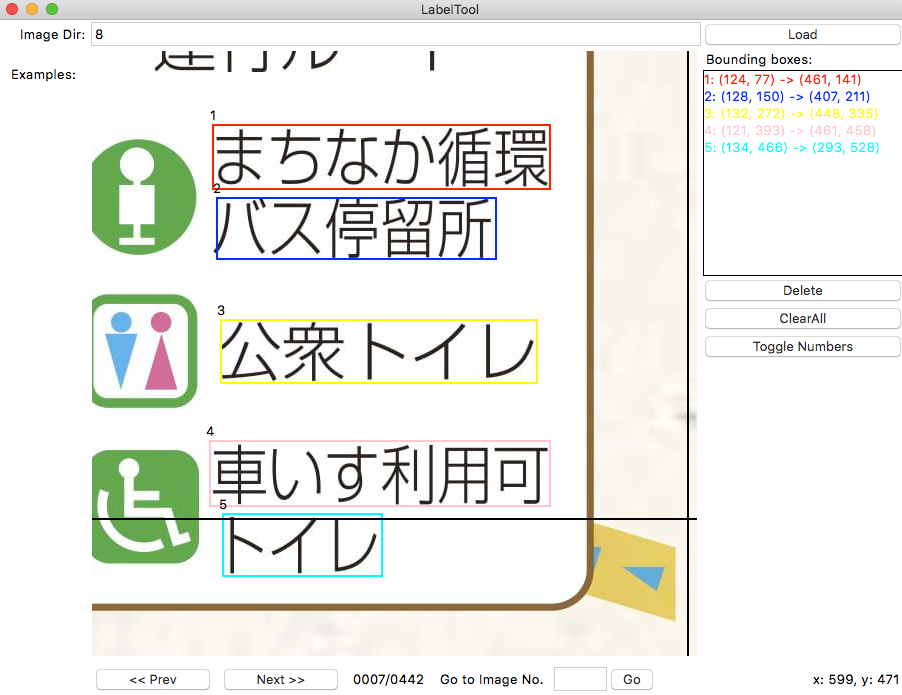

BBox-Label-Tool: Darkflow Annotations
===============

A simple tool for labeling object bounding boxes in images, implemented with Python Tkinter.

**Changes in this fork:**
- Besides the .txt file. Save the annotations as an .xml file with the format of PASCAL VOC. As expected by 
[Darkflow](https://github.com/thtrieu/darkflow), the Tensorflow translation of [Darknet's YOLO: Real-Time Object Detection](https://pjreddie.com/darknet/yolo/).
- Button to show/hide bounding box number. This helps in the case the data set nees to be modified, 
removing or redoing several boxes.
- Support multiple file extensions: ".jpg", ".jpeg", ".JPG", ".JPEG"
- Do not crash if there is no Examples/<number> for the loaded dir. Is good to have them, but is not mandatory.

**Screenshot:**

Data Organization
-----------------
LabelTool  
|  
|--main.py   *# source code for the tool*  
|  
|--Images/   *# directory containing the images to be labeled*  
|  
|--Labels/   *# directory for the labeling results*  
|  
|--Examples/  *# directory for the example bboxes*  
|  
|--AnnotationsXML/  *# directory for the labeling results to be used by **Darkflow***  

Environment
----------
- python 2.7
- python PIL (Pillow)

Run
-------
$ python main.py

Usage
-----
0. The current tool requires that **the images to be labeled reside in /Images/001, /Images/002, etc. You will need to modify the code if you want to label images elsewhere**.
1. Input a folder number (e.g, 1, 2, 5...), and click `Load`. The images in the folder, along with a few example results will be loaded.
2. To create a new bounding box, left-click to select the first vertex. Moving the mouse to draw a rectangle, and left-click again to select the second vertex.
  - To cancel the bounding box while drawing, just press `<Esc>`.
  - To delete a existing bounding box, select it from the listbox, and click `Delete`.
  - To delete all existing bounding boxes in the image, simply click `ClearAll`.
3. After finishing one image, click `Next` to advance. Likewise, click `Prev` to reverse. Or, input an image id and click `Go` to navigate to the speficied image.
  - Be sure to click `Next` after finishing a image, or the result won't be saved. 
